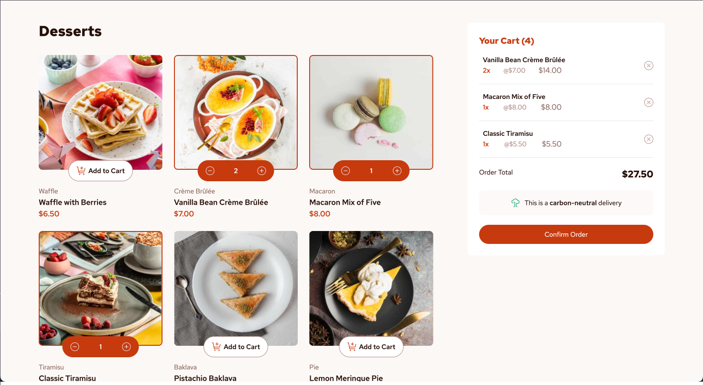

# Frontend Mentor - Product list with cart solution

This is a solution to the [Product list with cart challenge on Frontend Mentor](https://www.frontendmentor.io/challenges/product-list-with-cart-5MmqLVAp_d). Frontend Mentor challenges help you improve your coding skills by building realistic projects. 

## Table of contents

- [Overview](#overview)
  - [The challenge](#the-challenge)
  - [Screenshot](#screenshot)
  - [Links](#links)
- [My process](#my-process)
  - [Built with](#built-with)
  - [What I learned](#what-i-learned)
  - [Continued development](#continued-development)
- [Author](#author)

## Overview

### The challenge

Users should be able to:

- Add items to the cart and remove them
- Increase/decrease the number of items in the cart
- See an order confirmation modal when they click "Confirm Order"
- Reset their selections when they click "Start New Order"
- View the optimal layout for the interface depending on their device's screen size
- See hover and focus states for all interactive elements on the page

### Screenshot

### Links

- Solution URL: [FE-Mentor solutions](https://www.frontendmentor.io/solutions/product-list-with-cart-made-with-typescript-and-tailwindcss-b3VonvNSEt)
- Live Site URL: [fe-mentor-product-list-with-cart](https://fe-mentor-product-list-with-cart.netlify.app/)

## My process

### Built with

- Semantic HTML5 markup
- Flexbox
- CSS Grid
- TypeScript
- [React](https://reactjs.org/) - JS library
- [Vite.js](https://vitejs.dev/) - JS build tool
- [Tailwindcss](https://tailwindcss.com/docs/installation) - For styles

### What I learned

This was my first full project using TypeScript. It was great to learn how to keep my code strictly typed, the thought of TypeScript speeding up the programmers ability to code was not quite there as I got to grips with interfaces and assigning datatypes all over the place, but it's a start on the right path.

Another part of learning for me is that next time I will make sure I build mobile first, and larger devices second / third. I discovered that with the way I built the app, once it was time to bring in breakpoints for mobile phones, the breakpoints were not small enough, so it would have been easier and cleaner to have started with my generic sizing for mobiles and then using md: lg: and xl: as required. 

### Continued development

I want to build my next project again with the same tools of TypeScipt and Tailwind, to solidify my understading with both. 

This project can also do with some refactoring into different components, as it's currently just one giant app.tsx - which nobody loves! 

## Author

- Website - [Joe Freeman](https://joefreeman.me)
- Frontend Mentor - [@joefreeman8](https://www.frontendmentor.io/profile/joefreeman8)

